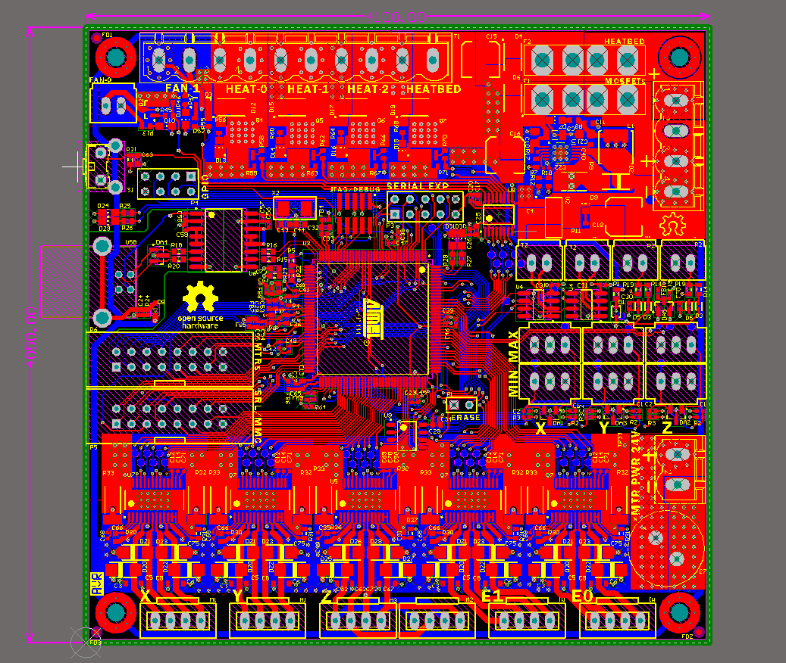
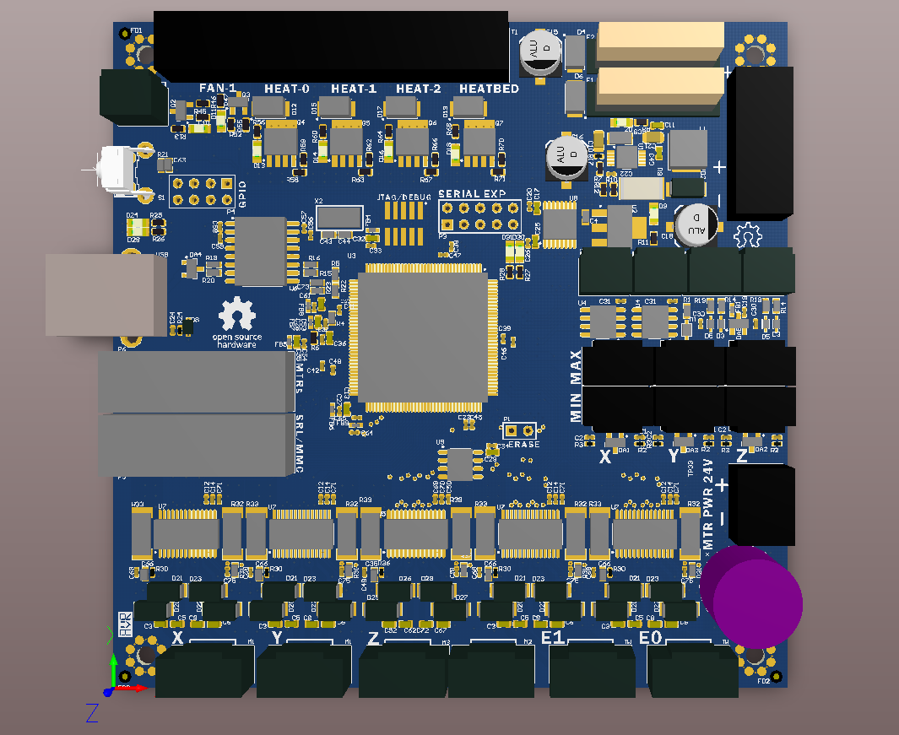
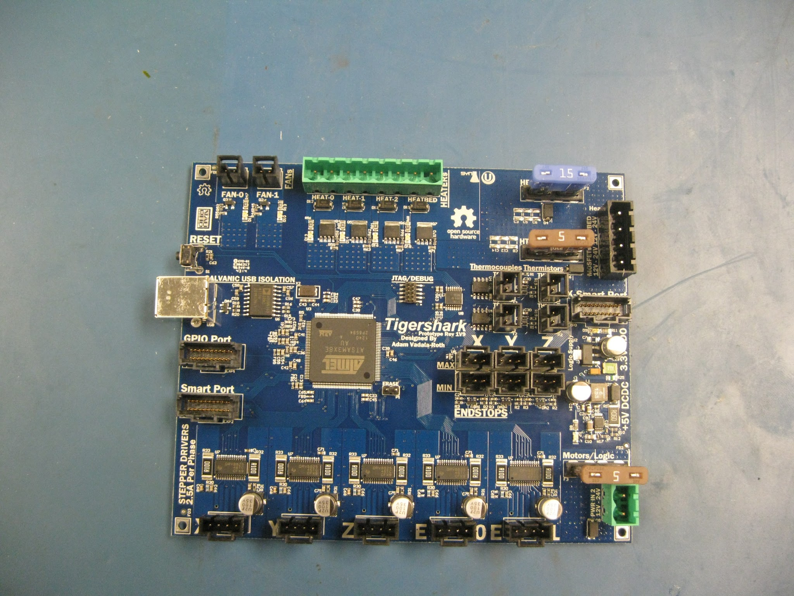
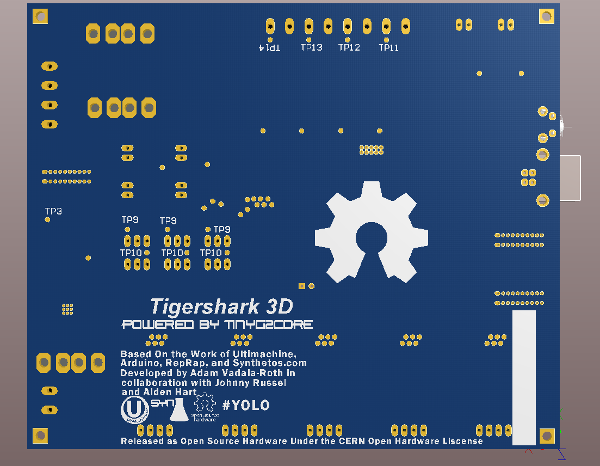

Tigershark3D
============

NOTE: Project has been forked into the AMBIT/Archim project by Ultimachine, its the commercial implementation of the Tigershark 3D printer controller prototype. Learn more here: https://github.com/ultimachine/AMBIT

A TinyG Powered 3D printer controller for RepRap, based on the RAMBo by Ultimachine, the Arduino DUE, and the TinyG from Synthetos.com

More On TinyG Firmware Here:

AVR Version of TinyG

https://github.com/synthetos/TinyG

ARM Version of TinyG

https://github.com/synthetos/g2

- Powered by the TinyG CNC Firmware from Sythetos.com
- Atmel ATSAM3X8E ARM Cortex M3 (DUE)
- Arduino DUE Compatible
- 5 Texas Instruments DRV8825 Stepper Drivers handle up to 2.5A per phase
- 6 MOSFETs for Heat and fans
- Ti TPIC46L01 Low-Side Automotive MOSFET Driver
- 2 MAX31855EASA+ Thermocouple ADCs
- Two Thermistors
- 2A 3.3V Power for Logic
- 3A 5V power for offboard systems and powering 3.3v Logic regulator
- USB bust power jumperable for firmware flashing purposes
- Firmware flashing via BOSSA
- Max/Min Endstops for 3 Axis
- 6 MOSFETs driven with a gate driver off PWM for heat and fans
- Offboard Expansion Port, generic GPIO expansion, and Kinen interface compatible (https://github.com/kinen/kinen/wiki)
-  True Galvanic Isolation of the USB port and full USB 2.0 Speeds

TinyG 2 ARM Firmware Repository: https://github.com/synthetos/g2

BOSSA Atmel SAM Firmware Flashing Tool: https://github.com/shumatech/BOSSA

Rev2 Update:

Tigershark Rev2 saw a large amount of pin function remapping, mostly to correct the PWM issues int he rev1 board. In addition to the corrections in the circuitry Tigershark has been shrunk and reshaped into the same formfactor and breakout as the RAMBo the board that has heavily inspired Tigershark.

Rev2 2D :

Rev2 3D :

Fabrication Update:

Tigershark rev 1 runs TinyG G2 successfully and connects to Chilipeppr. Rev1 was not without its electrical bugs though, motor ref PWMs for the extruder channels were bound and inverted same issue with two of the mosfets. The rev2 design will have to be repinned to correct these issues. Rev 1 is also too large and expensive and rev2 will see quite a size shrink down and most definitely the same formfactor as the RAMBo. All in all prototype run was successful, all the subsystem circuits have been confirmed and rev2 will be completed soon after. Even though rev2 has to be done to correct the PWM signal issues the plan is to still get rev1 printing so some traces will be cut and jumper wires applied to get it setup to drive a single nozzle reprap.

Rev 1 Fabricated Working Prototype:

Rev 1 Prototype Design

A 3D rendering

Bottom

Based on the work of:

Arduino

http://arduino.cc/

https://github.com/arduino/Arduino

Ultimachine

https://ultimachine.com

https://github.com/ultimachine/RAMBo

Synthetos

https://sythetos.com

https://github.com/synthetos/g2

https://github.com/synthetos/TinyG

(https://github.com/kinen/kinen/wik

Released as Open Source Hardware Under the CERN Open Hardware Liscense
