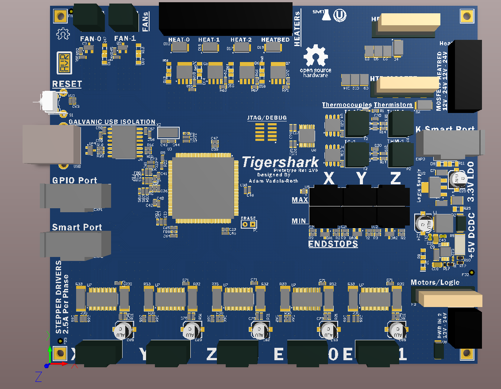

Tigershark3D
============

A TinyG Powered 3D printer controller, based on the RAMBo by Ultimachine and the Arduino DUE
More On TinyG Firmware Here:
https://github.com/synthetos/g2

- Atmel ATSAM3X8E ARM Cortex M3 (DUE)
- Arduino DUE Compatible
- 5 Texas Instruments DRV8825 Stepper Drivers handle up to 2.5A per phase
- 6 MOSFETs for Heat and fans
- Allegro A3944 Low-Side Automotive MOSFET Driver
- 2 MAX31855EASA+ Thermocouple ADCs
- Two Thermistors
- 2A 3.3V Power for Logic
- 3A 5V power for offboard systems and powering 3.3v Logic regulator
- USB bust power jumperable for firmware flashing purposes
- Firmware flashing via BOSSA
- Max/Min Endstops for 3 Axis
- 6 MOSFETs driven with a gate driver off PWM for heat and fans
- Offboard Expansion Port, generic GPIO expansion, and Kinen interface compatible (https://github.com/kinen/kinen/wiki)

Revision 1 of prototype zero 9/7/14 - Rev1 Finished!

A 3D rendering

Released as Open Source Hardware Under the CERN Liscense
